* Table of Contents
{:toc}

--------------------------------------------------------------------------------------------------------------------

## **1. Acknowledgements**

* {list here sources of all reused/adapted ideas, code, documentation, and third-party libraries -- include links to the original source as well}

--------------------------------------------------------------------------------------------------------------------

## **2. Setting up, getting started**

Refer to the guide [_Setting up and getting started_](SettingUp.md).

--------------------------------------------------------------------------------------------------------------------

## **3. Design**

:bulb: **Tip:** The `.puml` files used to create diagrams in this document can be found in the [diagrams](https://github.com/se-edu/addressbook-level3/tree/master/docs/diagrams/) folder. Refer to the [_PlantUML Tutorial_ at se-edu/guides](https://se-education.org/guides/tutorials/plantUml.html) to learn how to create and edit diagrams.

### 3.1 Architecture

The ***Architecture Diagram*** given above explains the high-level design of the App.

Given below is a quick overview of main components and how they interact with each other.

**Main components of the architecture**

**`Main`** has two classes called [`Main`](https://github.com/se-edu/addressbook-level3/tree/master/src/main/java/seedu/address/Main.java) and [`MainApp`](https://github.com/se-edu/addressbook-level3/tree/master/src/main/java/seedu/address/MainApp.java). It is responsible for,
* At app launch: Initializes the components in the correct sequence, and connects them up with each other.
* At shut down: Shuts down the components and invokes cleanup methods where necessary.

[**`Commons`**](#common-classes) represents a collection of classes used by multiple other components.

The rest of the App consists of four components.

* [**`UI`**](#ui-component): The UI of the App.
* [**`Logic`**](#logic-component): The command executor.
* [**`Model`**](#model-component): Holds the data of the App in memory.
* [**`Storage`**](#storage-component): Reads data from, and writes data to, the hard disk.

**How the architecture components interact with each other**

The *Sequence Diagram* below shows how the components interact with each other for the scenario where the user issues the command `delete 1`.

Each of the four main components (also shown in the diagram above),

* defines its *API* in an `interface` with the same name as the Component.
* implements its functionality using a concrete `{Component Name}Manager` class (which follows the corresponding API `interface` mentioned in the previous point).

For example, the `Logic` component defines its API in the `Logic.java` interface and implements its functionality using the `LogicManager.java` class which follows the `Logic` interface. Other components interact with a given component through its interface rather than the concrete class (reason: to prevent outside component's being coupled to the implementation of a component), as illustrated in the (partial) class diagram below.

The sections below give more details of each component.

### 3.2 UI component

The **API** of this component is specified in [`Ui.java`](https://github.com/se-edu/addressbook-level3/tree/master/src/main/java/seedu/address/ui/Ui.java)

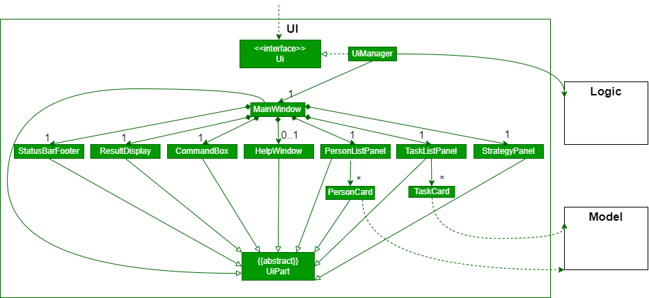

The UI consists of a `MainWindow` that is made up of parts e.g.`CommandBox`, `ResultDisplay`, `PersonListPanel`, `StatusBarFooter` etc. All these, including the `MainWindow`, inherit from the abstract `UiPart` class which captures the commonalities between classes that represent parts of the visible GUI.

The `UI` component uses the JavaFx UI framework. The layout of these UI parts are defined in matching `.fxml` files that are in the `src/main/resources/view` folder. For example, the layout of the [`MainWindow`](https://github.com/se-edu/addressbook-level3/tree/master/src/main/java/seedu/address/ui/MainWindow.java) is specified in [`MainWindow.fxml`](https://github.com/se-edu/addressbook-level3/tree/master/src/main/resources/view/MainWindow.fxml)

The `UI` component,

* executes user commands using the `Logic` component.
* listens for changes to `Model` data so that the UI can be updated with the modified data.
* keeps a reference to the `Logic` component, because the `UI` relies on the `Logic` to execute commands.
* depends on some classes in the `Model` component, as it displays `Person` object residing in the `Model`.

### 3.3 Logic component

**API** : [`Logic.java`](https://github.com/se-edu/addressbook-level3/tree/master/src/main/java/seedu/address/logic/Logic.java)

Here's a (partial) class diagram of the `Logic` component:

How the `Logic` component works:
1. When `Logic` is called upon to execute a command, it uses the `AddressBookParser` class to parse the user command.
1. This results in a `Command` object (more precisely, an object of one of its subclasses e.g., `AddCommand`) which is executed by the `LogicManager`.
1. The command can communicate with the `Model` when it is executed (e.g. to add a person).
1. The result of the command execution is encapsulated as a `CommandResult` object which is returned back from `Logic`.

The Sequence Diagram below illustrates the interactions within the `Logic` component for the `execute("delete 1")` API call.

:information_source: **Note:** The lifeline for `DeleteCommandParser` should end at the destroy marker (X) but due to a limitation of PlantUML, the lifeline reaches the end of diagram.

Here are the other classes in `Logic` (omitted from the class diagram above) that are used for parsing a user command:

How the parsing works:
* When called upon to parse a user command, the `AddressBookParser` class creates an `XYZCommandParser` (`XYZ` is a placeholder for the specific command name e.g., `AddCommandParser`) which uses the other classes shown above to parse the user command and create a `XYZCommand` object (e.g., `AddCommand`) which the `AddressBookParser` returns back as a `Command` object.
* All `XYZCommandParser` classes (e.g., `AddCommandParser`, `DeleteCommandParser`, ...) inherit from the `Parser` interface so that they can be treated similarly where possible e.g, during testing.

### 3.4 Model component
**API** : [`Model.java`](https://github.com/se-edu/addressbook-level3/tree/master/src/main/java/seedu/address/model/Model.java)

The `Model` component,

* stores the address book data i.e., all `Person` objects (which are contained in a `UniquePersonList` object).
* stores the currently 'selected' `Person` objects (e.g., results of a search query) as a separate _filtered_ list which is exposed to outsiders as an unmodifiable `ObservableList<Person>` that can be 'observed' e.g. the UI can be bound to this list so that the UI automatically updates when the data in the list change.
* stores a `UserPref` object that represents the user’s preferences. This is exposed to the outside as a `ReadOnlyUserPref` objects.
* stores `Note` objects in three separate lists for each `Person` object.
* does not depend on any of the other three components (as the `Model` represents data entities of the domain, they should make sense on their own without depending on other components)

### 3.5 Storage component

**API** : [`Storage.java`](https://github.com/se-edu/addressbook-level3/tree/master/src/main/java/seedu/address/storage/Storage.java)

The `Storage` component,
* can save both address book data and user preference data in json format, and read them back into corresponding objects.
* inherits from both `AddressBookStorage` and `UserPrefStorage`, which means it can be treated as either one (if only the functionality of only one is needed).
* depends on some classes in the `Model` component (because the `Storage` component's job is to save/retrieve objects that belong to the `Model`)

### 3.6 Common classes

Classes used by multiple components are in the `seedu.addressbook.commons` package.

--------------------------------------------------------------------------------------------------------------------

## **4. Implementation**

This section describes some noteworthy details on how certain features are implemented.

### 4.1 Contact Management

#### 4.1.1 Add Feature

##### Implementation

This feature allows the user to add persons to the person list. It is facilitated by `ModelManager` which
makes use of the method `#addPerson()` to add a new person to the person list.

Given below is an example usage scenario of how the add person mechanism behaves at each step.

Step 1: The user inputs `add-p n/Johnson p/83918273 a/Woodlands Avenue 4 e/johnson@gmail.com` to add a new person to the person list.

Step 2: This argument is passed into `LogicManager` which calls on `Coach2K22Parser#parseCommand()` to find a suitable parser class to process the user inputs. This initialises the `AddPersonCommandParser` where its method `#parse()` is called to process the user inputs.

Step 3: It then returns a newly initialised `AddPersonCommand` back to the `LogicManager` for command execution.

Step 4: During the command execution, the `ModelManager#addPerson()` is called which adds the new person to an internal list and updates the GUI display. A new contact named "Johnson" with his relevant details is then shown in the person list.

The steps above are summarised using a sequence diagram as shown below.

##### Design Consideration

**Aspect: Should there be an abstraction for persons:**

* **Alternative 1 (current choice):** Separate `add-p` command for creating a person.
    * Pros: Easy to extend and modify.
    * Cons: Not as intuitive for the user.
* **Alternative 2:** Single `add` command that adds tasks/persons depending on parameters.
    * Pros: More intuitive for the user.

#### 4.1.2 Delete Feature

##### Implementation

This feature allows the user to delete persons from the person list. It is facilitated by `ModelManager` which
makes use of the method `#deletePerson()` to delete a person from the person list. The method `#setTask()` is also called to ensure that the deleted person is removed from all tasks.

Given below is an example usage scenario of how the delete person mechanism behaves at each step.

Step 1: The user inputs `del-p 1` to delete the first person in the person list.

Step 2: This argument is passed into `LogicManager` which calls on `Coach2K22Parser#parseCommand()` to find a suitable parser class to process the user inputs. This initialises the `DeletePersonCommandParser` where its method `#parse()` is called to process the user inputs.

Step 3: It then returns a newly initialised `DeletePersonCommand` back to the `LogicManager` for command execution.

Step 4: During the command execution, the `ModelManager#setTask()` method is called multiple times to remove the
corresponding person from all the tasks in the task list. After which, the `ModelManager#deletePerson()` method is called to delete the specified person from the person list.

Step 5: The GUI display is then updated to show a new contact and task list without the deleted person.

The steps above are summarised using a sequence diagram as shown below.

##### Design Consideration

**Aspect: Should there be an abstraction for persons:**

* **Alternative 1 (current choice):** Separate `del-p` command for deleting a person.
    * Pros: Easy to extend and modify.
    * Cons: Not as intuitive for the user.
* **Alternative 2:** Single `del` command that deletes tasks/persons depending on parameters.
    * Pros: More intuitive for the user.

#### 4.1.3 Edit Feature

##### Implementation

This feature allows the user to edit persons from the person list. It is facilitated by `ModelManager` which
makes use of the method `#setPerson()` to update a person from the person list. If the person's name is edited in this process, the method `#setTask()` will be called to ensure all tasks tagged with this person is updated according.

Given below is an example usage scenario of how the edit person mechanism behaves at each step.

Step 1: The user inputs `edit-p 1 n/Johnson` to edit the first person in the person list.

Step 2: This argument is passed into `LogicManager` which calls on `Coach2K22Parser#parseCommand()` to find a suitable parser class to process the user inputs. This initialises the `EditPersonCommandParser` where its method `#parse()` is called to process the user inputs.

Step 3: It then returns a newly initialised `EditPersonCommand` back to the `LogicManager` for command execution.

Step 4: During the command execution, the `ModelManager#setTask()` method is called multiple times to update the
name of the corresponding person in all the tasks. After which, the `ModelManager#setPerson()` method is called to update the specified person in the person list.

Step 5: The GUI display is then updated to show a new contact and task list with the updated person details.

The steps above are summarised using a sequence diagram as shown below.
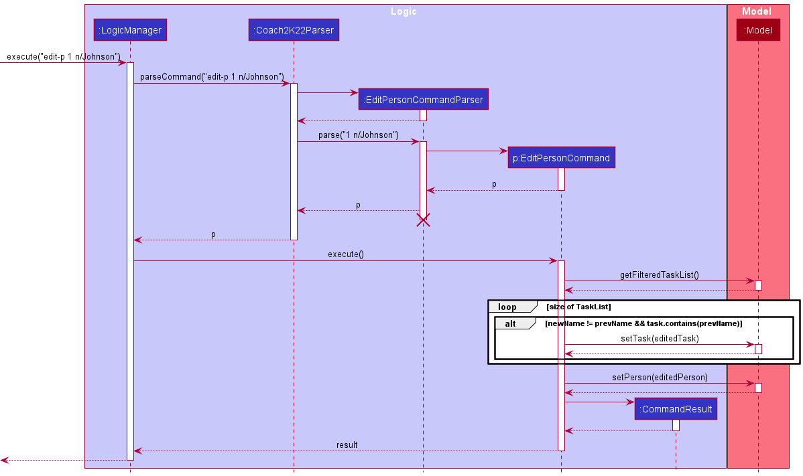

##### Design Consideration

**Aspect: Should there be an abstraction for persons:**

* **Alternative 1 (current choice):** Separate `edit-p` command for editing a person.
    * Pros: Easy to extend and modify.
    * Cons: Not as intuitive for the user.
* **Alternative 2:** Single `edit` command that edits tasks/persons depending on parameters.
    * Pros: More intuitive for the user.

#### 4.1.4 Clear Feature

##### Implementation

This feature allows users to clear all persons from the person list.
It is facilitated by the `ModelManager` which sets a new `AddressBook` object to the `ModelManager` to clear the person list. The method `#setTask()` will also be called to ensure all tasks do not have any persons tagged to it.

Given below is an example usage scenario of how the clear person mechanism behaves at each step.

Step 1: The user inputs `clear-p` to clear all persons from the person list.

Step 2: This argument is passed into the `LogicManager` which calls on `Coach2K22Parser#parseCommand()` to find a suitable
parser class which corresponds with the provided command to parse the user's inputs.

Step 3: Since there are no arguments for this command, a newly initialised `ClearPersonCommand` is returned to the `LogicManager` for command execution.

Step 4: During the command execution, the `ModelManager#setTask()` method is called multiple times to delete persons in all the tasks. After which, a new `AddressBook` object is passed into the `ModelManager#setAddressBook()` method which clears out the person list. 

Step 5: The GUI display is then updated to show an empty contact and new task list without any persons tagged to the tasks.

The steps above are summarised using a sequence diagram as shown below.
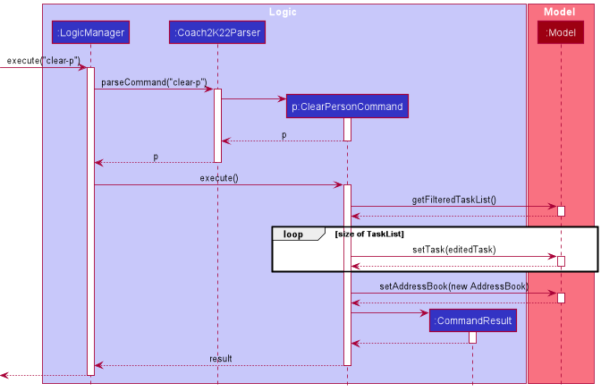

##### Design Consideration

**Aspect: Should there be separate clear commands for clearing tasks and persons:**

* **Alternative 1 (current choice):** A separate command for clearing tasks and persons.
    * Pros: Easy to implement.
    * Cons: Hard to extend.
* **Alternative 2:** A combined command for clearing tasks and persons.
  earPer  * Pros: Easier and more intuitive for the user to understand
    * Cons: Hard to implement.

#### 4.1.5 Add Tags Feature

##### Implementation
This feature allows the user to add tags to contacts in the list. It is facilitated by `ModelManager` which
makes use of the method `#setPerson()` and `#updateFilteredPersonList()` to add tags to a contact.

Given below is an example usage scenario of how the add tag mechanism behaves at each step.

Step 1: The user inputs `tag-add-p 1 friend` to add the tag "friend" to the first contact in the list.

Step 2: This argument is passed into `LogicManager` which calls on `Coach2K22Parser#parseCommand()` to find a suitable parser class to process the user inputs. This initialises the `AddTagCommandParser` where its method `#parse` is called to process the user inputs.

Step 3: It then returns a newly initialised `AddTagCommand` back to the `LogicManager` for command execution. This `AddTagCommand` contains information about the new tag (in this case, "friend")

Step 4: During the command execution, the `ModelManager#setPerson()` is called which edits the tags of the person with the user-supplied tags. The filtered person list is updated with `ModelManager#updateFilteredPersonList` to display the new information to the user.

The steps above are summarised using a sequence diagram as shown below.

##### Design Consideration

**Aspect: Should the implementation use the existing edit functionalities in Coach2K22:**
* **Alternative 1:**  Use the current EditCommand class to edit a person's tags.
    * Pros: Maintains abstraction and reuses code instead of writing new code.
    * Cons: Creates a cyclic dependency, making the code base harder to maintain later on

* **Alternative 2 (current choice):** Implement AddTagCommand independently, rewriting similar code
    * Pros: Cleaner code and less dependencies
    * Cons: Repetitive code that is not abstracted

#### 4.1.6 Find Feature

##### Implementation

This feature allows the user to display selected persons in the contact list. It is facilitated by `ModelManager` which 
makes use of the method `#updateFilteredPersonList()` to find persons by name or tag.

Given below is an example usage scenario of how the find person mechanism behaves at each step.

Step 1: The user inputs `find n/Alex t/friends` to find selected persons.

Step 2: This argument is passed into `LogicManager` which calls on `Coach2K22Parser#parseCommand()` to find a suitable parser class to process the user inputs. This initialises the `FindPersonCommandParser` where its method `#parse()` is called to process the user inputs. 

Step 3: It then returns a newly initialised `FindPersonCommand` back to the `LogicManager` for command execution.

Step 4: During the command execution, the `ModelManager#updateFilteredPersonList()` is called which updates the GUI display with only selected persons shown in the contact list. The command results are then generated and shown to the user.

The steps above are summarised using a sequence diagram as shown below.

##### Design Consideration

**Aspect: Should there be a separate find command for name and tag:**

* **Alternative 1 (current choice):** A combined command for finding name and tag.
    * Pros: Easy to implement.
    * Cons: Users may have to remember more prefixes.

* **Alternative 2:** A separate command for finding name and tag.
    * Pros: Commands may be more intuitive to the users.
    * Cons: Possible violation of the DRY principle.

**Aspect: Should there be separate find commands for finding tasks and persons:**

* **Alternative 1 (current choice):** A separate command for finding tasks and persons.
    * Pros: Easy to implement.
    * Cons: Hard to extend.

* **Alternative 2:** A combined command for finding tasks and persons.
    * Pros: Easier and more intuitive for the user to understand.
    * Cons: Hard to implement.

#### 4.1.7 Add Strength/Weakness/Misc Features

##### Implementation

These features allow the user to add a strength, weakness, or miscellaneous note to a person in the person list . It is facilitated by `ModelManager` which
makes use of the method `#setPerson()` to replace the particular person with the new person with modified note list (depending on the given command).

Given below is an example usage scenario of how the Add Strength mechanism behaves at each step._Note that three commands have similar implementations, so only the Add Strength feature implementation will be provided here._

Step 1: The user inputs `strength-add 1 great endurance` to add the strength `great endurance` to the person in index `1` of the person list.

Step 2: This argument is passed into `LogicManager` which calls on `Coach2K22Parser#parseCommand()` to find a suitable parser class to process the user inputs. This initialises the `AddStrengthCommandParser` where its method `#parse()` is called to process the user inputs.

Step 3: It then returns a newly initialised `AddStrengthCommand` back to the `LogicManager` for command execution.

Step 4: During the command execution, `ModelManager#setPerson()` method is called to update the specified person in the person list with the new strength list.

The steps above are summarised using a sequence diagram as shown below. Note that all occurrences of `Strength` or `AddStrengthCommand` (and similar instances) will be generalized to `Note` and `AddNoteCommand` respectively to represent the implementation of the Add Strength, Weakness, and Misc features.
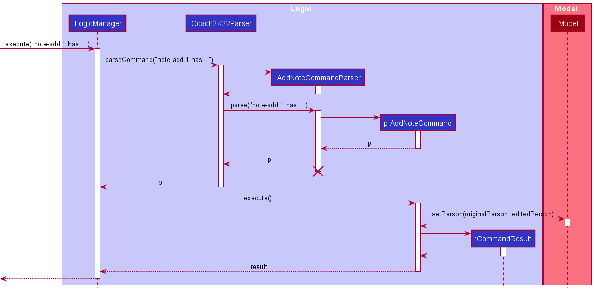

##### Design Consideration

**Aspect: Should there be different note lists for each person:**

* **Alternative 1 (current choice):** Separate `note-add` command into three different commands.
    * Pros: Easier to use and more intuitive.
    * Cons: Difficult to extend and modify.
* **Alternative 2:** Single `note-add` command for adding to each list with provided prefixes.
    * Pros: Easier to extend and modify.
    * Cons: Not intuitive for the user and more prone to feature flaws

#### 4.1.8 Delete Strength/Weakness/Misc Features

##### Implementation

These features allow the user to delete a strength, weakness, or miscellaneous note from a person in the person list . It is facilitated by `ModelManager` which
makes use of the method `#setPerson()` to replace the particular person with the new person with modified note list (depending on the given command).

Given below is an example usage scenario of how the Delete Strength mechanism behaves at each step._Note that three commands have similar implementations, so only the Delete Strength feature implementation will be provided here._

Step 1: The user inputs `strength-del 1 1` to delete the first strength from the person in index `1` of the person list.

Step 2: This argument is passed into `LogicManager` which calls on `Coach2K22Parser#parseCommand()` to find a suitable parser class to process the user inputs. This initialises the `DeleteStrengthCommandParser` where its method `#parse()` is called to process the user inputs.

Step 3: It then returns a newly initialised `DeleteStrengthCommand` back to the `LogicManager` for command execution.

Step 4: During the command execution, `ModelManager#setPerson()` method is called to update the specified person in the person list with the new strength list.

The steps above are summarised using a sequence diagram as shown below. Note that all occurrences of `Strength` or `DeleteStrengthCommand` (and similar instances) will be generalized to `Note` and `AddNoteCommand` respectively to represent the implementation of the Delete Strength, Weakness, and Misc features.
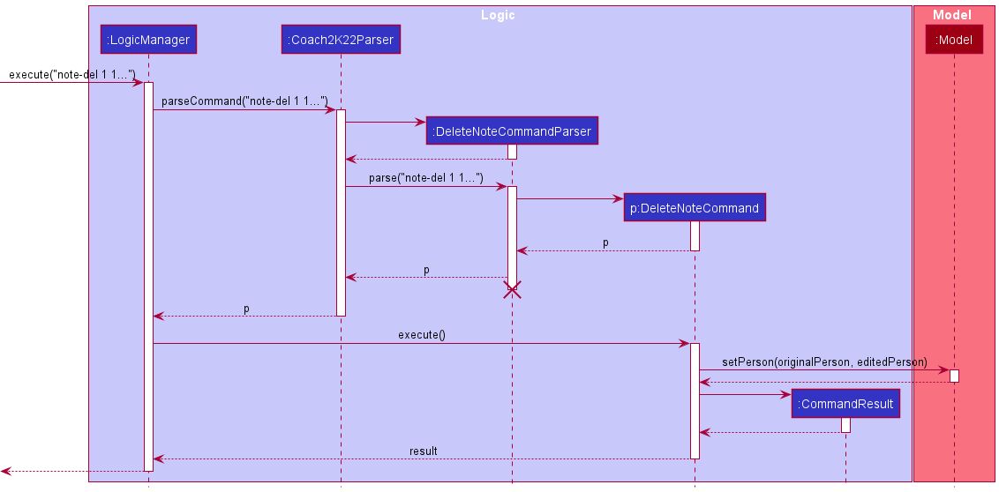

##### Design Consideration

**Aspect: Should there be different note lists for each person:**

* **Alternative 1 (current choice):** Separate `note-del` command into three different commands.
  * Pros: Easier to use and more intuitive.
  * Cons: Difficult to extend and modify.
* **Alternative 2:** Single `note-del` command for adding to each list with provided prefixes.
  * Pros: Easier to extend and modify.
  * Cons: Not intuitive for the user and more prone to feature flaws

#### 4.1.10 Sort by Strength/Weakness Features

##### Implementation

These features allow the user to sort the person list by the total number of strengths/weaknesses in descending order. It is facilitated by `ModelManager` which
makes use of the method `#setAddressBook()` to replace the address book with the newly sorted person list without modification.

Given below is an example usage scenario of how the Sort Strength mechanism behaves at each step._Note that two commands have similar implementations, so only the Sort Strength feature implementation will be provided here._

Step 1: The user inputs `sort-strength` to sort the entire person list by total number of strengths in descending order.

Step 2: This argument is passed into `LogicManager` which calls on `Coach2K22Parser#parseCommand()` to find the command class to process the command.

Step 3: It then returns a newly initialised `SortStrengthCommand` back to the `LogicManager` for command execution.

Step 4: During the command execution, `ModelManager#setAddressBook()` method is called to update the person list with the newly sorted list of persons based on total number of strengths in descending order.

The steps above are summarised using a sequence diagram as shown below. Note that all occurrences of `Strength` or `SortStrengthCommand` (and similar instances) will be generalized to `Note` and `SortNoteCommand` respectively to represent the implementation of the Sort by Strength and Weakness features.
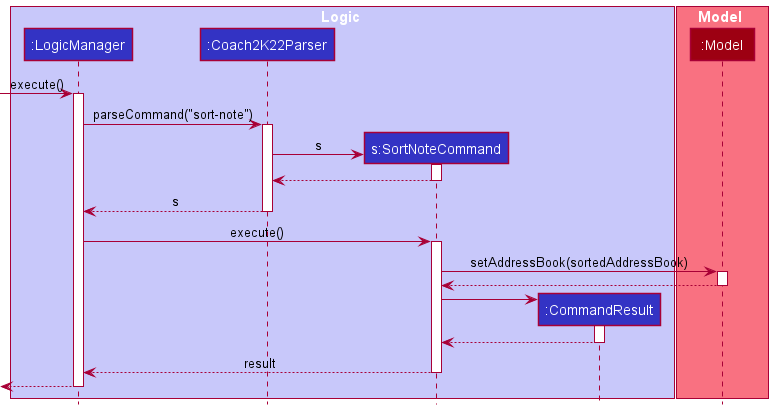

##### Design Consideration

**Aspect: Should there be different sorting functions for address book and schedule:**

* **Alternative 1 (current choice):** Use different commands for sorting the address book and schedule.
  * Pros: Easier to use and more intuitive.
  * Cons: Difficult to extend and modify.
* **Alternative 2:** Single `sort` command for sorting the `AddressBook` and `TaskBook`.
  * Pros: Easier to extend and modify.
  * Cons: Not intuitive for the user and difficult to implement

### 4.2 Task Management

#### 4.2.1 Add Feature

##### Implementation

This feature allows the user to add tasks to the task list. It is facilitated by `ModelManager` which
makes use of the method `#addTask()` to add a new task to the task list.

Given below is an example usage scenario of how the add task mechanism behaves at each step.

Step 1: The user inputs `add-t n/Meet d/11-11-2022 st/11:00 et/01:00` to add a new task to the task list.

Step 2: This argument is passed into `LogicManager` which calls on `Coach2K22Parser#parseCommand()` to find a suitable parser class to process the user inputs. This initialises the `AddTaskCommandParser` where its method `#parse()` is called to process the user inputs.

Step 3: It then returns a newly initialised `AddTaskCommand` back to the `LogicManager` for command execution.

Step 4: During the command execution, the `ModelManager#addTask()` is called which adds the new task to an internal list and updates the GUI display. A new task named "Meet" with the subsequent date and time details is then shown in the task list.

The steps above are summarised using a sequence diagram as shown below.
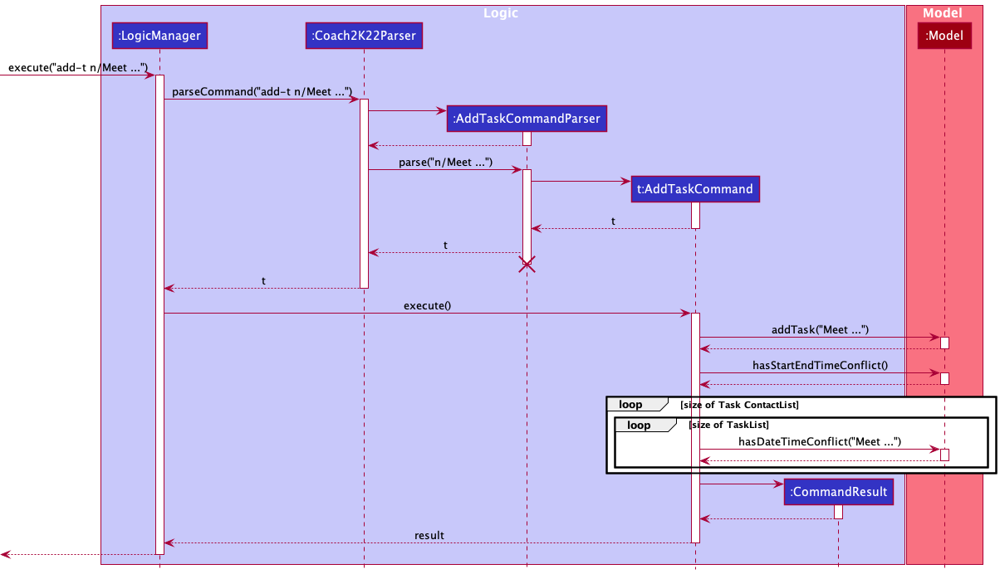

##### Design Consideration

**Aspect: Should there be an abstraction for tasks:**

* **Alternative 1 (current choice):** Separate `add-t` command for creating a task.
    * Pros: Easy to extend and modify.
    * Cons: Not as intuitive for the user.
* **Alternative 2:** Single `add` command that adds tasks/persons depending on parameters.
    * Pros: More intuitive for the user.

#### 4.2.2 Delete Feature

##### Implementation

This feature allows the user to delete tasks from the task list. It is facilitated by `ModelManager` which
makes use of the method `#deleteTask()` to delete a task from the task list.

Given below is an example usage scenario of how the delete task mechanism behaves at each step.

Step 1: The user inputs `del-t 1` to delete the first task in the task list.

Step 2: This argument is passed into `LogicManager` which calls on `Coach2K22Parser#parseCommand()` to find a suitable parser class to process the user inputs. This initialises the `DeleteTaskCommandParser` where its method `#parse()` is called to process the user inputs.

Step 3: It then returns a newly initialised `DeleteTaskCommand` back to the `LogicManager` for command execution.

Step 4: During the command execution, the `ModelManager#deleteTask()` is called which deletes the specified person from an internal list and updates the GUI display. A new task list without the deleted task then shown.

The steps above are summarised using a sequence diagram as shown below.

##### Design Consideration

**Aspect: Should there be an abstraction for tasks:**

* **Alternative 1 (current choice):** Separate `del-t` command for deleting a task.
    * Pros: Easy to extend and modify.
    * Cons: Not as intuitive for the user.
* **Alternative 2:** Single `del` command that deletes tasks/persons depending on parameters.
    * Pros: More intuitive for the user.

#### 4.2.3 Edit Feature

##### Implementation

This feature allows the user to edit tasks from the task list. It is facilitated by `ModelManager` which
makes use of the method `#setTask()` to update a task from the task list.

Given below is an example usage scenario of how the edit task mechanism behaves at each step.

Step 1: The user inputs `edit-p 1 n/Meeting` to edit the first task in the task list.

Step 2: This argument is passed into `LogicManager` which calls on `Coach2K22Parser#parseCommand()` to find a suitable parser class to process the user inputs. This initialises the `EditTaskCommandParser` where its method `#parse()` is called to process the user inputs.

Step 3: It then returns a newly initialised `EditTaskCommand` back to the `LogicManager` for command execution.

Step 4: During the command execution, the `ModelManager#setTask()` is called which edits the specified task from an internal list and updates the GUI display. A new task list with the updated task details is then shown.

The steps above are summarised using a sequence diagram as shown below.
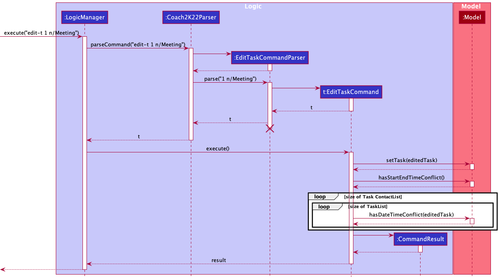

##### Design Consideration

**Aspect: Should there be an abstraction for tasks:**

* **Alternative 1 (current choice):** Separate `edit-t` command for editing a task.
    * Pros: Easy to extend and modify.
    * Cons: Not as intuitive for the user.
* **Alternative 2:** Single `edit` command that edits tasks/persons depending on parameters.
    * Pros: More intuitive for the user.
    
#### 4.2.4 Clear Feature

##### Implementation

This feature allows users to clear all tasks from the task list, or only tasks that correspond with a given date.
It is facilitated by the `ModelManager` which utilizes the method `deleteTask()` to delete each corresponding task one
by one, or sets a new `TaskBook` object to the `ModelManager` to refresh the task list.

Given below is an example usage scenario of how the clear task mechanism behaves at each step.

Step 1: The user inputs `clear-t 2022-10-10` to clear all tasks that correspond with the date `2022-10-10` in the task list.

Step 2: This argument is passed into the `LogicManager` which calls on `Coach2K22Parser#parseCommand()` to find a suitable
parser class which corresponds with the provided command to parse the user's inputs. This initializes the `ClearTaskCommandParser`,
where its method `parse()` is called to process the user inputs.

Step 3: The newly initialized `ClearTaskCommandParser` is then returned to the `LogicManager` for command execution.

Step 4: During the command execution, the `ModelManager#deleteTask()` method is called multiple times to remove the
corresponding tasks from the internal task list. Inside the function call, the `ModelManager#updateFilteredTaskList()`
is also called, which updates the GUI to display the new task list. The command results are then generated and shown to
the user.

The steps above are summarised using a sequence diagram as shown below.
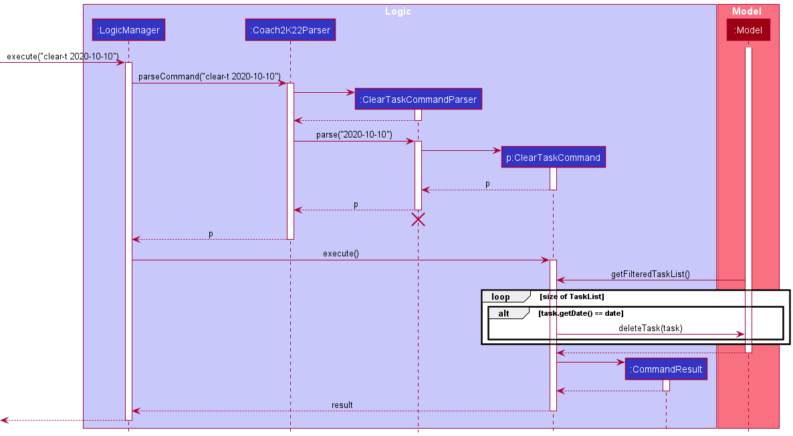

##### Design Consideration

**Aspect: Should there be separate clear commands for clearing tasks and players:**

* **Alternative 1 (current choice):** A separate command for clearing tasks and players.
    * Pros: Easy to implement.
    * Cons: Hard to extend.
* **Alternative 2:** A combined command for clearing tasks and player.
    * Pros: Easier and more intuitive for the user to understand
    * Cons: Hard to implement.

#### 4.2.5 Find Feature

##### Implementation

This feature allows the user to display selected tasks in the task list. It is facilitated by `ModelManager` which
makes use of the method `#updateFilteredTaskList()` to find tasks by name or tag.

Given below is an example usage scenario of how the find task mechanism behaves at each step.

Step 1: The user inputs `find n/meeting t/friends` to find selected tasks.

Step 2: This argument is passed into `LogicManager` which calls on `Coach2K22Parser#parseCommand()` to find a suitable parser class to process the user inputs. This initialises the `FindTaskCommandParser` where its method `#parse()` is called to process the user inputs.

Step 3: It then returns a newly initialised `FindTaskCommand` back to the `LogicManager` for command execution.

Step 4: During the command execution, the `ModelManager#updateFilteredTaskList()` is called which updates the GUI display with only selected tasks shown in the task list. The command results are then generated and shown to the user.

The steps above are summarised using a sequence diagram as shown below.

##### Design Consideration

**Aspect: Should there be a separate find command for name and tag:**

* **Alternative 1 (current choice):** A combined command for finding name and tag.
    * Pros: Easy to implement.
    * Cons: Users may have to remember more prefixes.

* **Alternative 2:** A separate command for finding name and tag.
    * Pros: Commands may be more intuitive to the users.
    * Cons: Possible violation of the DRY principle.

**Aspect: Should there be separate find commands for finding tasks and persons:**

* **Alternative 1 (current choice):** A separate command for finding tasks and persons.
    * Pros: Easy to implement.
    * Cons: Hard to extend.
    
* **Alternative 2:** A combined command for finding tasks and persons.
    * Pros: Easier and more intuitive for the user to understand.
    * Cons: Hard to implement.

#### 4.2.6 Get Person Feature

##### Implementation

This feature allows the user to retrieve contact details of persons tagged to a selected task in the task list. It is facilitated by `ModelManager` which
makes use of the method `#updateFilteredPersonList()` to get persons tagged to a task.

Given below is an example usage scenario of how the get person mechanism behaves at each step.

Step 1: The user inputs `get-person 1` to retrieve contact details of persons tagged to the first task.

Step 2: This argument is passed into `LogicManager` which calls on `Coach2K22Parser#parseCommand()` to find a suitable parser class to process the user inputs. This initialises the `GetPersonCommandParser` where its method `#parse()` is called to process the user inputs.

Step 3: It then returns a newly initialised `GetPersonCommand` back to the `LogicManager` for command execution.

Step 4: During the command execution, the `ModelManager#updateFilteredPersonList()` is called. The GUI display then updates the person list - showing only the contact details of persons tagged to the specified task.  

The steps above are summarised using a sequence diagram as shown below.
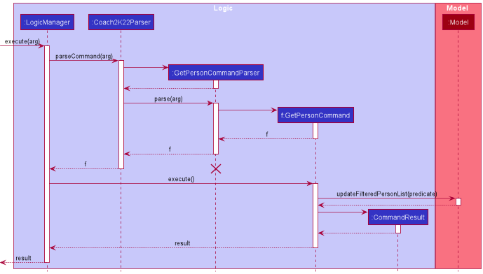
    
### 4.3 Strategic Planning

#### 4.3.1 Add Feature

##### Implementation

This feature allows the user to add players to the strategy board. It is facilitated by `ModelManager` which 
makes use of the method `#addPlayer()` and `#updateFilteredPlayerList()` to add a new player to the strategy board.

Given below is an example usage scenario of how the add player mechanism behaves at each step.

Step 1: The user inputs `add-player Cena` to add a new player to the strategy board.

Step 2: This argument is passed into `LogicManager` which calls on `Coach2K22Parser#parseCommand()` to find a suitable parser class to process the user inputs. This initialises the `AddPlayerCommandParser` where its method `#parse()` is called to process the user inputs. 

Step 3: It then returns a newly initialised `AddPlayerCommand` back to the `LogicManager` for command execution.

Step 4: During the command execution, the `ModelManager#addPlayer()` is called which adds the new player to an internal list and updates the GUI display with a new player named "Cena" shown in the strategy board. The command results are then generated and shown to the user.

The steps above are summarised using a sequence diagram as shown below.

##### Design Consideration

**Aspect: Should there be an abstraction for players:**

* **Alternative 1 (current choice):** A player is a String of player name.
    * Pros: Easy to implement.
    * Cons: Hard to extend.
* **Alternative 2:** A player is an object of class `Player`.
    * Pros: Easy to extend and manipulate attributes of a player.
    * Cons: Hard to implement.

#### 4.3.2 Load Court Feature

##### Implementation

This feature allows the user to load an image to serve as the background of the strategy board. It is facilitated by `CommandResult` which
carries a representation of the image to the `MainWindow` to update the background of the strategy board accordingly.

Given below is an example usage scenario of how the load court mechanism behaves at each step.

Step 1: The user inputs `load-court basketball` to load the image from the filepath `courts/basketball.png` to serve as the background of strategy board.

Step 2: This argument is passed into `LogicManager` which calls on `Coach2K22Parser#parseCommand()` to find a suitable parser class to process the user inputs. This initialises the `LoadCourtCommandParser` where its method `#parse()` is called to process the user inputs.

Step 3: It then returns a newly initialised `LoadCourtCommand` back to the `LogicManager` for command execution.

Step 4: During the command execution, the `CommandResult` object is returned to the `MainWindow`, where `CommandResult#getBackgroundImage()` is called to retrieve the image representation. Then, `MainWindow#handleLoadImage(back)` is called to update the background of the strategy board with a new image. The command results are then generated and shown to the user.

The steps above are summarised using a sequence diagram as shown below.
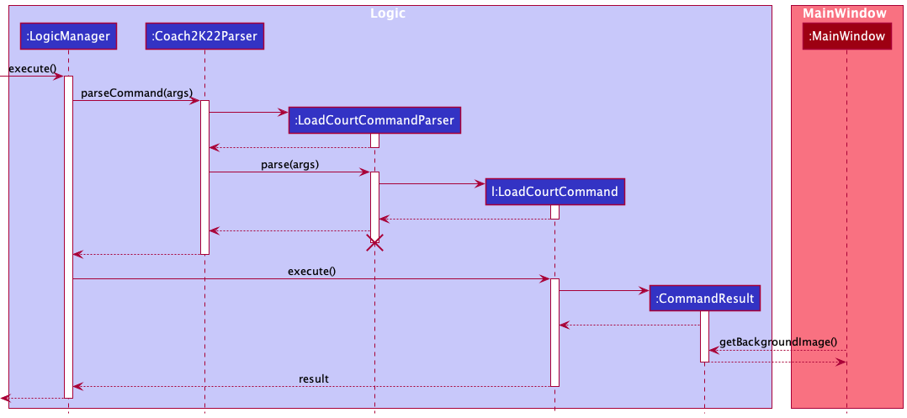

##### Design Consideration

**Aspect: Should there be different filetypes for images:**

* **Alternative 1 (current choice):** Only png images are allowed.
  * Pros: Easy to implement.
  * Cons: Hard to extend and not intuitive for the user.
* **Alternative 2:** Allow for different filetypes of images (png, jpeg, etc.).
  * Pros: Easy to extend and more intuitive for the user.
  * Cons: Hard to implement.
    
    
--------------------------------------------------------------------------------------------------------------------

## **5. Documentation, logging, testing, configuration, dev-ops**

* [Documentation guide](Documentation.md)
* [Testing guide](Testing.md)
* [Logging guide](Logging.md)
* [Configuration guide](Configuration.md)
* [DevOps guide](DevOps.md)

--------------------------------------------------------------------------------------------------------------------

## **6. Appendix: Requirements**

### 6.1 Product scope

**Target user profile**:  

* is a coach managing a team of players
* has a need to manage a significant number of players
* prefer desktop apps over other types
* can type fast
* prefers typing to mouse interactions
* is reasonably comfortable using CLI apps
* needs to keep track of administrative tasks
* can help enhance decision-making during games instantaneously

**Value proposition**: helps busy sports coaches organise their overwhelming lists of contacts and messy weekly
schedules, and provides them with a platform to visualise defensive and offensive plays as the game unfolds

### 6.2 User stories

Priorities: High (must have) - `* * *`, Medium (nice to have) - `* *`, Low (unlikely to have) - `*`

| Priority | As a …​                  | I want to …​                                                    | So that I can…​                                                            |
|----------|---------------------------------|-----------------------------------------------------------------|------------------------------------------------------------------------------|
| `* * *`  | forgetful coach                 | enter team-specific or player note                              | look up these information                                                    |
| `* * *`  | coach                           | delete team-specific or player note                             | keep these information relevant and up-to-date                               |
| `* * *`  | forgetful coach                 | remember the names of players on my team                        | look up them in case I forget                                                |
| `* * *`  | disorganized                    | add and tag new roles/teams to a contact                        | easily retrieve relevant information                                         |
| `* * *`  | coach                           | easily retrieve contact information of relevant parties         | quickly broadcast information to them                                        |
| `* * *`  | organized coach                 | view players by their strengths and weaknesses                  | make informed decision on choosing the best person                           |
| `* * *`  | disorganized coach              | add existing and upcoming tasks                                 | keep track of my schedule easily                                             |
| `* * *`  | disorganized coach              | delete wrongly added or past tasks                              | organize my schedule better                                                  |
| `* *`    | lazy and forgetful coach        | view a list of help commands and their descriptions             | easily recall how to do a specific task                                      |
| `* *`    | organised coach                 | view players by their strengths and weaknesses                  | make informed decisions on choosing the best person for a specific objective |
| `**`     | organized and data-driven coach | sort my players by strengths and weaknesses                     | get a better understanding of how players compare                            |
| `*`      | strategic coach                 | change the position of players (x-y coordinate) during the game | ensure my team works together                                                |
| `*`      | coach                           | drag and drop a player into a calendar                          | plan scheduled events for them according to their needs                      |

### 6.3 Use cases

(For all use cases below, the **System** is `Coach2K22` and the **Actor** is the `user`, unless specified otherwise)

#### 6.3.1 Contact Management

**Use case: Add a person**

**MSS**

1.  User requests to add a new person in the list
2.  Coach2K22 shows a list with the newly added person

    Use case ends.

**Extensions**

* 1a. The parameters supplied by the user is invalid.
  
    * 1a1. Coach2K22 shows an error message.
      
      Use case ends.

* 1b. Compulsory parameters not supplied by the user.

    * 1b1. Coach2K22 shows an error message.

      Use case ends.

**Use case: Delete a person**

**MSS**

1.  User requests to list persons
2.  Coach2K22 shows a list of persons
3.  User requests to delete a specific person in the list
4.  Coach2K22 deletes the person

    Use case ends.

**Extensions**

* 2a. The list is empty.

  Use case ends.

* 3a. The given index is invalid.

    * 3a1. Coach2K22 shows an error message.

      Use case resumes at step 2.
    
**Use case: Add a strength to a person**

**MSS**

1. User requests to list persons
2. Coach2K22 shows a list of persons
3. User requests to add a strength to a person
4. Coach2K22 shows the new details of the person

    Use case ends.

**Extensions**

* 2a. The person list is empty.

    * 2a1. Coach2K22 shows an error message.

      Use case ends.

* 3a. The given list index cannot be found in Coach2K22.

    * 3a1. Coach2K22 shows an error message.

      Use case resumes at step 2.

* 3b. The strength provided is an empty string.

    * 3b1. Coach2K22 shows an error message.

      Use case resumes at step 2.

**Use case: Add a weakness to a person**

* This use case describes a similar interaction between the user and Coach2K22 to that of `Add a strength to a person`
  * Takes in a weakness instead of a strength

**Use case: Add a miscellaneous note to a person**

* This use case describes a similar interaction between the user and Coach2K22 to that of `Add a strength to a person`
    * Takes in a miscellaneous note instead of a strength

**Use case: Delete a strength from a person**

**MSS**

1. User requests to list persons
2. Coach2K22 shows a list of persons
3. User requests to delete a strength for a person
4. Coach2K22 shows the new details of the person

    Use case ends.

**Extensions**

* 2a. The person list is empty.

    * 2a1. Coach2K22 shows an error message.

      Use case ends.

* 3a. The given list index is invalid.

    * 3a1. Coach2K22 shows an error message.

      Use case resumes at step 2.

* 3b. Strengths have not been assigned to the person.

    * 3b1. Coach2K22 shows an error message.

      Use case resumes at step 2.

* 3c. The given strength index is invalid.

    * 3c1. Coach2K22 shows an error message.

      Use case resumes at step 2.

**Use case: Delete a weakness from a person**

* This use case describes a similar interaction between the user and Coach2K22 to that of `Delete a strength from a person`
    * Takes in a weakness index instead of a strength index

**Use case: Delete a miscellaneous note from a person**

* This use case describes a similar interaction between the user and Coach2K22 to that of `Delete a strength from a person`
    * Takes in a misc. index instead of a strength index
    
**Use case: Find persons by name or tag**

**MSS**

1.  User requests to list persons with a specific name or tag
2.  Coach2K22 shows a list of filtered persons

    Use case ends.

**Extensions**

* 1a. The given name and tag keywords cannot be found in Coach2K22.

    * 1a1. Coach2K22 shows an empty list.

      Use case ends.
    
* 1b. The keyword provided is not indicated by a prefix e.g. `n/` or `t/`.

    * 1b1. Coach2K22 shows an error message.

      Use case ends.

* 1c. No keywords are provided after the `find` command.

    * 1c1. Coach2K22 shows an error message.

      Use case ends.
    
* 1d. Missing keyword after a prefix is given e.g. `n/` or `t/`.
  
    * 1d1. Coach2K22 shows an error message.

      Use case ends.    

**Use case: Sort address book by strengths in descending order**

**MSS**

1. User requests to sort the list of persons by total number of strengths
2. Coach2K22 shows the new sorted list of persons

   Use case ends.

**Extensions**

* 1a. The person list is empty.

    * 1a1. Coach2K22 shows an error message.

      Use case ends.

**Use case: Sort address book by weaknesses in descending order**

* This use case describes a similar interaction between the user and Coach2K22 to that of `Sort address book by strengths in descending order`
    * Sorts list of persons by total number of weaknesses in descending order instead of total number of strengths
    
**Use case: Add a tag to a person**

**MSS**

1. User requests to list persons
2. Coach2K22 shows a list of persons
3. User requests to attach a new tag to a person
4. Coach2k22 shows the new details of the person
   
   Use case ends.

**Extensions**

* 2a. The list is empty

  Use case ends.

**Use case: Delete a tag from a person**

**MSS**

1. User requests to list persons
2. Coach2K22 shows a list of persons
3. User requests to remove an existing tag from a person
4. Coach2k22 shows the updated details of the person

   Use case ends.

**Extensions**

* 2a. The list is empty.

  Use case ends.
@
* 3a. The tag requested to remove does not exist for the person.

    * 3a1. Coach2K22 shows an error message.

      Use case ends.

* 3b. No argument for tag removal is provided.

    * 3b1. Coach2K22 shows an error message.

      Use case ends.

#### 6.3.2 Task Management

**Use case: Add a task to the task list**

**MSS**

1.  User requests to add a new task to the list
2.  Coach2K22 shows a list with the newly added task

    Use case ends.

**Extensions**

* 1a. The parameters supplied by the user is invalid.

    * 1a1. Coach2K22 shows an error message.

      Use case resumes at step 1.

* 1b. Compulsory parameters not supplied by the user.

    * 1b1. Coach2K22 shows an error message.

      Use case resumes at step 1.

**Use case: Delete a task from the task list**

**MSS**

1. User requests to view the list of tasks
2. Coach2K22 shows a list of tasks
3. User requests to delete a specific task from the list
4. Coach2K22 deletes the task

    Use case ends.

**Extensions**

* 1a. The task list is empty.

  Use case ends.

* 3a. The index requested does not exist.

    * 3a1. Coach2K22 shows an error message.

      Use case resumes at step 2

**Use case: Clear all tasks from task list**

**MSS**

1. User requests to list tasks
2. Coach2K22 shows a list of tasks
3. User requests to clear the task list
4. Coach2k22 shows the updated details of the task list

   Use case ends.

**Extensions**

* 2a. The task list is empty.

  Use case ends.

**Use case: Clear all tasks for a specified date from task list**

**MSS**

1. User requests to list tasks
2. Coach2K22 shows a list of tasks
3. User requests to clear all tasks of a specified date from the task list
4. Coach2k22 shows the updated details of the task list

   Use case ends.

**Extensions**

* 2a. The task list is empty.

  Use case ends.

* 3a. The provided date is not in the correct format.

  Use case resumes at step 2.

**Use case: Add a tag to a task from task list**

**MSS**

1. User requests to list tasks
2. Coach2K22 shows a list of tasks
3. User requests to add a tag to a task of a specified index in the task list
4. Coach2k22 shows the updated details of the task list

  Use case ends.

**Extensions**

* 2a. The task list is empty.

  Use case ends.

**Use case: Remove a tag from a task in task list**

**MSS**

1. User requests to list tasks
2. Coach2K22 shows a list of tasks
3. User requests to remove a tag from a task of a specified index in the task list
4. Coach2K22 shows the updated details of the task list

   Use case ends.

**Extensions**

* 1a. The task list is empty.

  Use case ends.

* 3a. The task does not have that specified tag.

  Use case resumes at step 2.

* 3b. The index provided is invalid.

  Use case resumes at step 2.

**Use case: Find tasks by name or tag**

**MSS**

1.  User requests to view the list of tasks
2.  Coach2K22 shows a list of filtered tasks

    Use case ends.

**Extensions**

* 1a. The given name and tag keywords cannot be found in Coach2K22.

    * 1a1. Coach2K22 shows an empty list.

      Use case ends.

* 1b. The keyword provided is not indicated by a prefix e.g. `n/` or `t/`.

    * 1b1. Coach2K22 shows an error message.

      Use case ends.

* 1c. No keywords are provided after the `find` command.

    * 1c1. Coach2K22 shows an error message.

      Use case ends.

* 1d. Missing keyword after a prefix is given e.g. `n/` or `t/`.

    * 1d1. Coach2K22 shows an error message.

      Use case ends.

**Use case: Find persons tagged to a task**

**MSS**

1. User requests to view the list of tasks
2. Coach2K22 shows a list of tasks
3. User requests to find persons tagged to a specified task from the list
4. Coach2K22 shows a filtered list containing the specified persons 

    Use case ends.

**Extensions**

* 1a. The task list is empty.

  Use case ends.

* 3a. The index requested does not exist.

    * 3a1. Coach2K22 shows an error message.

      Use case resumes at step 2

* 3b. No persons are tagged to the specified task.

    * 3b1. Coach2K22 shows an empty contact list.

      Use case ends

**Use case: Sort task list by date**

**MSS**

1. User requests to sort the task list by date.
2. Coach2k22 shows the updated task list, sorted with the tasks with the earliest deadline at the top.

   Use case ends.

**Extensions**

* 1a. The task list is empty.

  Use case ends.

#### 6.3.3 Strategic Planning

**Use case: Add a new player to the strategy board**

**MSS**

1. User requests to show all players on the strategy board
2. Coach2K22 shows players
3. User requests to add a new player to the strategy board
4. Coach2K22 shows the updated strategy board with the new player

   Use case ends.

**Extensions**
* 3a. The player name is invalid.
    * 3a1. Coach2K22 shows an error message.

      Use case resumes at step 2.
* 3b. The player name is already on the strategy board.
    * 3b1. Coach2K22 shows an error message.

      Use case resumes at step 2.
* 3c. The player name is not provided.
    * 3c1. Coach2K22 shows an error message.

      Use case resumes at step 2.

**Use case: Remove a player from the strategy board**

**MSS**

1. User requests to show all players on the strategy board
2. Coach2K22 shows players
3. User requests to remove a player from the strategy board
4. Coach2K22 shows the updated strategy board without the player

   Use case ends.

**Extensions**
* 3a. The player name is invalid.
    * 3a1. Coach2K22 shows an error message.

      Use case resumes at step 2.
* 3b. The player name is not on the strategy board.
    * 3b1. Coach2K22 shows an error message.

      Use case resumes at step 2.
* 3c. The player name is not provided.
    * 3c1. Coach2K22 shows an error message.

      Use case resumes at step 2.

**Use case: Load new background image for strategy tab**

**MSS**

1. User requests load a new background image.
2. Coach2k22 shows the updated strategy tab with the new background image.

   Use case ends.

**Extensions**

* 1a. Provided name of image is invalid.

  Use case ends.

* 1b. Image does not exist.

  Use case ends.

* 1c. Image is not in `png` format.

  Use case ends.

### 6.4 Non-Functional Requirements

1. Should work on any _mainstream OS_ as long as it has Java `11` or above installed.
2. Should be able to hold up to 1000 persons without a noticeable sluggishness in performance for typical usage.
3. Should be able to hold up to 100 teams without a noticeable sluggishness in performance for typical usage.
4. Should be able to hold up to 50 tags without a noticeable sluggishness in performance for typical usage.
5. Should be portable so moving from one OS to another OS will not create problems.
6. Should warn the user when attempting to delete a contact.
7. A user with above average typing speed for regular English text (i.e. not code, not system admin commands) should be able to accomplish most of the tasks faster using commands than using the mouse.

### 6.5 Glossary

* **Mainstream OS**: Windows, Linux, Unix, OS-X
* **Private contact detail**: A contact detail that is not meant to be shared with others
* **Time-clash**: An error where the user attempts to schedule an event at the same time as another
* **Switchover**: The action of switching a player for another on a given field
* **Liability-Potential** The statistics of a player's overall penalties and injuries across games
* **DRY Principle** The *Don't Repeat Yourself (DRY)* is a Software Engineering principle of reducing repetition in the code

*{More to be added}*
--------------------------------------------------------------------------------------------------------------------

## **7. Appendix: Instructions for manual testing**

Given below are instructions to test the app manually.

:information_source: **Note:** These instructions only provide a starting point for testers to work on;
testers are expected to do more *exploratory* testing.

### 7.1 Launch and shutdown

1. Initial launch

   1. Download the jar file and copy into an empty folder

   2. Double-click the jar file Expected: Shows the GUI with a set of sample contacts. The window size may not be optimum.

2Saving window preferences

   1. Resize the window to an optimum size. Move the window to a different location. Close the window.

   2. Re-launch the app by double-clicking the jar file. 
       Expected: The most recent window size and location is retained.

### 7.2 Deleting a person

1. Deleting a person while all persons are being shown

   1. Prerequisites: List all persons using the `list` command. Multiple persons in the list.

   2. Test case: `delete 1` 
      Expected: First contact is deleted from the list. Details of the deleted contact shown in the status message. Timestamp in the status bar is updated.

   3. Test case: `delete 0` 
      Expected: No person is deleted. Error details shown in the status message. Status bar remains the same.

   4. Other incorrect delete commands to try: `delete`, `delete x`, `...` (where x is larger than the list size) 
      Expected: Similar to previous.
   
### 7.3 Saving data

1. Dealing with missing/corrupted data files

   1. _{explain how to simulate a missing/corrupted file, and the expected behavior}_

### 7.4 Adding a Strength/Weakness/Miscellaneous note to a person

1. Adding a strength/weakness/miscellaneous (using `strength-add`, `weakness-add`, and `misc-add` respectively) note to a person while currently viewable person list has people.

2. Prerequisites: Currently viewable Contacts list has to contain some people.

3. Test case: `strength-add 1 good stamina` 
   Expected: The note `good stamina` is added to the strength list of the first person in the current Contacts list. Details of the modified contact shown in the status message.

4. Test case: `weakness-add 1 bad stamina` 
   Expected: The note `bad stamina` is added to the weakness list of the first person in the current Contacts list. Details of the modified contact shown in the status message.

5. Test case: `misc-add 1 likes ice cream` 
   Expected: The note `likes ice cream` is added to the misc list of the first person in the current Contacts list. Details of the modified contact shown in the status message.

6. Test case: `strength-add 0 good stamina` 
   Expected: No note is added. Error details shown in the status message. Status bar remains the same.

7. Other incorrect commands to try: `strength-add`, `misc-add x`, `...` (where x is larger than the list size) 
   Expected: Similar to previous.

### 7.5 Deleting a Strength/Weakness/Miscellaneous note to a person

1. Deleting a strength/weakness/miscellaneous note (using `strength-del`, `weakness-del`, and `misc-del` respectively) to a person while currently viewable person list has people.

2. Prerequisites: Currently viewable Contacts list has to contain some people.

3. Test case: `strength-del 1 1` 
   Expected: The first note is deleted from the strength list of the first person in the current Contacts list. Details of the modified contact shown in the status message.

4. Test case: `weakness-del 1 1` 
   Expected: Similar to previous, except the note is deleted from the weakness list.

5. Test case: `misc-del 1 1` 
      Expected: Similar to previous, except the note is deleted from the misc list.

6. Test case: `strength-del 0 1` 
   Expected: No note is deleted. Error details shown in the status message. Status bar remains the same.

7. Test case: `strength-del 1 0` 
   Expected: Similar to previous.

8. Other incorrect commands to try: `strength-del`, `misc-del x`, `...` (where x is larger than the list size) 
   Expected: Similar to previous.

### 7.6 Clearing all Tasks from the task list or only those on a particular day

1. Empty the task list or remove only those that correspond with a given day.

2. Prerequisites: Unfiltered Schedule must contain some tasks.

3. Test case: `clear-t` 
   Expected: The entire task list in contacts will be cleared.

4. Test case: `clear-t d/03-03-2022` 
   Expected: If there are tasks that are allocated on `03-03-2022`, remove them. Otherwise, no task is deleted, and error details are shown in the status message.

5. Test case: `clear-t d/30-02-2022` 
   Expected: No task is deleted. Error details shown in the status message. Status bar remains the same.

6. Test case: `clear-t d/2022-03-03` 
   Expected: Similar to previous.

7. Other incorrect commands to try: `clear-t d/abc`, `clear-t d`, `clear-t d/`, `...` 
   Expected: Similar to previous.

### 7.7 Sort the Contacts list by strength or weakness in descending order

1. Sort the entire Contact list by strength (for `sort-strength`) or weakness (for `sort-weakness`) in descending order

2. Prerequisites: Unfiltered Contacts list must contain some people.

3. Test case: `sort-strength` 
   Expected: The entire contact list is sorted by total number of strengths in descending order.

4. Test case: `sort-weakness` 
      Expected: The entire contact list is sorted by total number of weaknesses in descending order.

5. Test case: `sort-strength abc` 
      Expected: The entire contact list is sorted by total number of strengths in descending order (anything after the command word is ignored).

### 7.8 Load new image to serve as court in Strategy Tab

1. Loads the given image by the provided name to serve as the court in Strategy Tab.

2. Prerequisites: Image must be a png file and stored in the automatically generated `courts` directory which exists in the same folder as the JAR.

3. Test case: `load-court basketball` 
   Expected: The image `basketball.png` will be loaded from the `courts` directory and serve as the court in the Strategy tab. If it does not exist, no image is loaded, and error details are shown in the status message.

4. Test case: `load-court` 
   Expected: No image is loaded, and error details are shown in the status message.

5. Test case: `load-court test/` 
   Expected: Similar to previous. Even if `test.png` exists, as `/` are not allowed in command argument.
